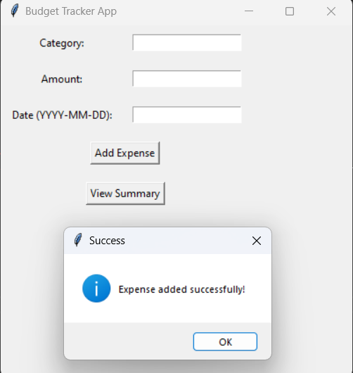

# Budget-Tracker

This Python code creates a **Budget Tracker App** using the **Tkinter** library for the graphical user interface (GUI) and **Pandas** for handling and analyzing expense data. The app allows users to input, track, and view a summary of their expenses in different categories.

### Key Features and Components:

#### 1. **Class Definition** (`BudgetApp`):
   - The `BudgetApp` class is the main part of the application and manages the GUI components and interactions. It contains methods for adding expenses and viewing a summary of the expenses.

#### 2. **Constructor Method** (`__init__`):
   - The `__init__` method initializes the main application window (`root`) and creates the initial layout with widgets like labels, entry fields, and buttons.
   - **DataFrame** (`self.expenses_df`): An empty Pandas DataFrame is created to store the expenses, which includes columns for 'Category', 'Amount', and 'Date'.
   - **Widgets**: Labels and entry fields are created for the user to input the expense's category, amount, and date.

#### 3. **Widgets Setup**:
   - **Labels**: These are used to indicate what information the user should enter (e.g., "Category", "Amount", "Date").
   - **Entry Widgets**: These are the text boxes where the user can type in their input for category, amount, and date.
   - **Buttons**: There are two buttons:
     - **"Add Expense"**: This button triggers the `add_expense` method to add an expense to the DataFrame.
     - **"View Summary"**: This button triggers the `view_summary` method to display the summary of expenses.

#### 4. **Adding an Expense** (`add_expense` method):
   - This method retrieves the values entered by the user (category, amount, and date) from the entry fields.
   - It checks if all fields are filled. If so:
     - It attempts to convert the entered amount to a float. If this fails, an error message is shown.
     - The new expense is appended to the `self.expenses_df` DataFrame.
     - The entry fields are cleared, and a success message is displayed using `messagebox.showinfo`.
   - If any of the fields are empty or if an invalid amount is entered, an error message is displayed.

#### 5. **Viewing the Summary** (`view_summary` method):
   - When the user clicks the "View Summary" button, the `view_summary` method creates a new window displaying:
     - A list of all the expenses in the DataFrame, including the category, amount, and date.
     - The total amount spent in each category, calculated using `self.expenses_df.groupby('Category')['Amount'].sum()`.
     - The overall total expenses, calculated using `self.expenses_df['Amount'].sum()`.
   - If no expenses have been added yet, a message is shown indicating that no data is available.

#### 6. **Running the App**:
   - The code at the end of the file creates an instance of `Tk()` (the main window), initializes the `BudgetApp` class, and runs the Tkinter main event loop using `root.mainloop()`. This keeps the app running and responsive to user input.

### Summary of Workflow:
- The user opens the app and can input an expense by entering a category, amount, and date.
- After entering the details, the user clicks the "Add Expense" button to add the expense to the DataFrame.
- The user can click the "View Summary" button to view a detailed summary of their expenses, including totals by category and overall.

### Example Use Case:
1. The user enters "Groceries" as the category, "1000" as the amount, and "2024-11-15" as the date, and then clicks "Add Expense".
2. The expense is added to the internal data structure (Pandas DataFrame).
3. The user can later click "View Summary" to see the list of expenses and the total amounts spent in each category.

This app helps users track their budget and expenses easily, offering insights into their spending habits by category and overall.